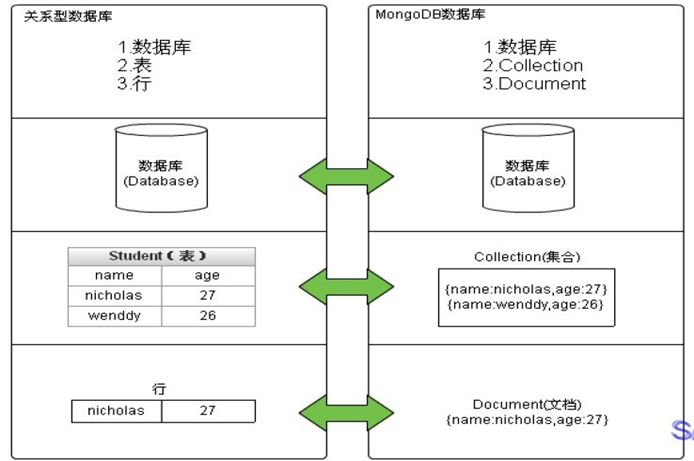
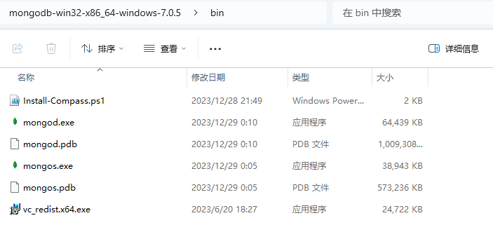
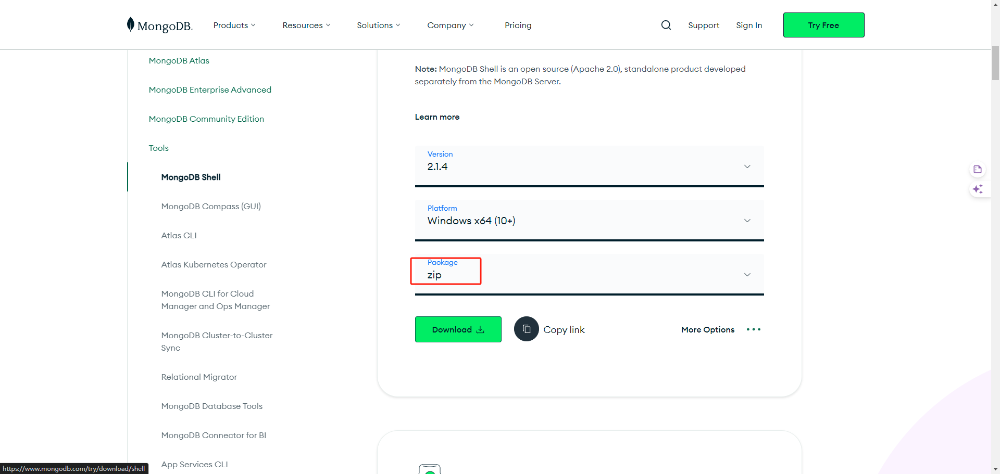
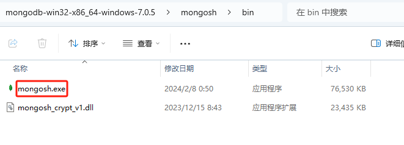
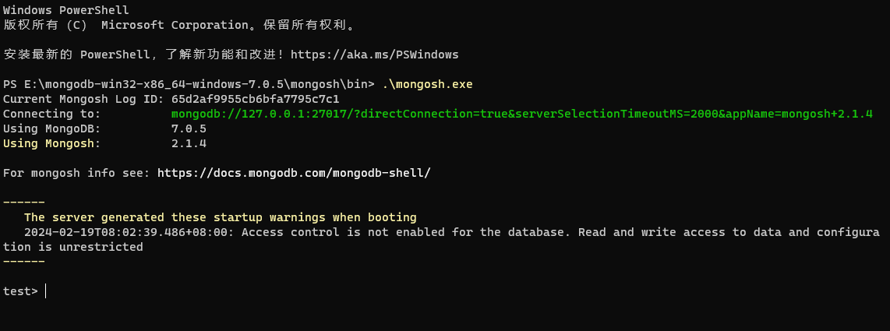
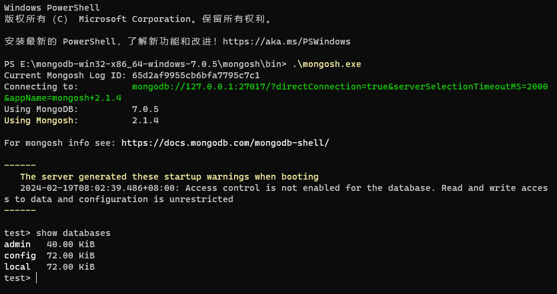
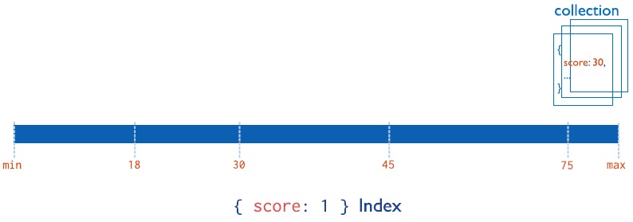
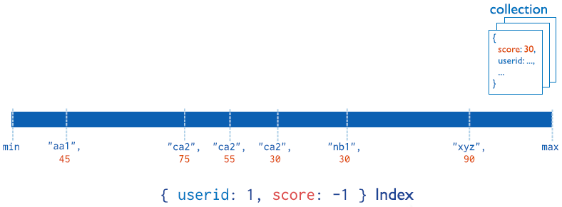
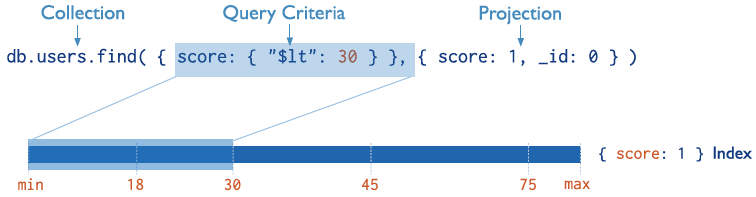

# MongoDB笔记

* [MongoDB相关概念](#mongodb相关概念)
  * [业务应用场景](#业务应用场景)
  * [MongoDB简介](#mongodb简介)
  * [体系结构](#体系结构)
  * [数据模型](#数据模型)
  * [MongoDB的特点](#mongodb的特点)
* [单机部署](#单机部署)
  * [Windows系统安装启动](#windows系统安装启动)
  * [Shell连接](#shell连接)
  * [Compass连接](#compass连接)
  * [Navicat连接](#navicat连接)
  * [Linux系统安装启动](#linux系统安装启动)
  * [针对错误](#针对错误)
* [基本常用命令](#基本常用命令)
  * [案例需求](#案例需求)
  * [数据库操作](#数据库操作)
    * [选择数据库（了解）](#选择数据库了解)
    * [删除数据库](#删除数据库)
  * [集合操作](#集合操作)
    * [显式创建集合](#显式创建集合)
    * [隐式创建集合](#隐式创建集合)
    * [删除集合](#删除集合)
  * [文档操作](#文档操作)
    * [文档的插入](#文档的插入)
      * [N个文档插入](#n个文档插入)
      * [单个文档插入](#单个文档插入)
      * [多个文档插入](#多个文档插入)
      * [注意和规范](#注意和规范)
    * [文档的查询](#文档的查询)
      * [N个文档查询](#n个文档查询)
      * [单个文档查询](#单个文档查询)
      * [投影查询](#投影查询)
    * [文档的更新](#文档的更新)
      * [N个文档更新](#n个文档更新)
      * [单个文档更新](#单个文档更新)
      * [多个文档查询](#多个文档查询)
    * [文档的删除](#文档的删除)
    * [文档的特殊查询](#文档的特殊查询)
      * [统计查询](#统计查询)
      * [分页查询](#分页查询)
      * [排序查询](#排序查询)
      * [模糊查询](#模糊查询)
      * [比较查询](#比较查询)
      * [包含查询](#包含查询)
      * [条件（与或）查询](#条件与或查询)
  * [常用命令小结](#常用命令小结)
* [索引](#索引)
  * [概述](#概述)
  * [索引的类型](#索引的类型)
    * [单域索引](#单域索引)
    * [复合索引](#复合索引)
    * [其他索引](#其他索引)
  * [索引的管理操作](#索引的管理操作)
    * [索引的查看](#索引的查看)
    * [索引的创建](#索引的创建)
    * [索引的移除](#索引的移除)
      * [指定索引的移除](#指定索引的移除)
      * [所有索引的移除](#所有索引的移除)
  * [索引的使用](#索引的使用)
    * [执行计划](#执行计划)
    * [涵盖的查询](#涵盖的查询)
* [文章评论模块](#文章评论模块)

# MongoDB相关概念

## 业务应用场景

传统的关系型数据库（如MySQL），在数据操作的“三高”需求以及应对 Web2.0 的网站需求面前，显得力不从心。

解释：“三高”需求：

- High performance - 对数据库高并发读写的需求。
- Huge Storage - 对海量数据的高效率存储和访问的需求。
- High Scalability && High Availability- 对数据库的高可扩展性和高可用性的需求。

**而MongoDB可应对“三高”需求。**

具体的应用场景如：

1. 社交场景，使用 MongoDB 存储存储用户信息，以及用户发表的朋友圈信息，通过地理位置索引实现附近的人、地点等功能。
2. 游戏场景，使用 MongoDB 存储游戏用户信息，用户的装备、积分等直接以内嵌文档的形式存储，方便查询、高效率存储和访问。
3. 物流场景，使用 MongoDB 存储订单信息，订单状态在运送过程中会不断更新，以 MongoDB 内嵌数组的形式来存储，一次查询就能将订单所有的变更读取出来。
4. 物联网场景，使用 MongoDB 存储所有接入的智能设备信息，以及设备汇报的日志信息，并对这些信息进行多维度的分析。
5. 视频直播，使用 MongoDB 存储用户信息、点赞互动信息等。

这些应用场景中，数据操作方面的共同特点是：

- 数据量大
- 写入操作频繁（读写都很频繁）
- 价值较低的数据，对事务性要求不高

对于这样的数据，我们更适合使用MongoDB来实现数据的存储。

**什么时候选择MongoDB？**

在架构选型上，除了上述的三个特点外，如果你还犹豫是否要选择它？可以考虑以下的一些问题：

- 应用不需要事务及复杂 join 支持
- 新应用，需求会变，数据模型无法确定，想快速迭代开发
- 应用需要2000-3000以上的读写QPS（更高也可以）
- 应用需要TB甚至 PB 级别数据存储
- 应用发展迅速，需要能快速水平扩展
- 应用要求存储的数据不丢失
- 应用需要99.999%高可用
- 应用需要大量的地理位置查询、文本查询

如果上述有1个符合，可以考虑 MongoDB，2个及以上的符合，选择 MongoDB 绝不会后悔。

## MongoDB简介

MongoDB是一个开源、高性能、无模式的文档型数据库，当初的设计就是用于简化开发和方便扩展，是NoSQL数据库产品中的一种。是最像关系型数据库（MySQL）的非关系型数据库。

它支持的数据结构非常松散，是一种类似于 JSON 的 格式叫BSON，所以它既可以存储比较复杂的数据类型，又相当的灵活。

MongoDB中的记录是一个文档，它是一个由字段和值对（field:value）组成的数据结构。MongoDB文档类似于JSON对象，即一个文档认为就是一个对象。字段的数据类型是字符型，它的值除了使用基本的一些类型外，还可以包括其他文档、普通数组和文档数组。

## 体系结构

MySQL和MongoDB对比：



| SQL术语/概念 | MongoDB术语/概念 | 解释/说明                            |
| ------------ | ---------------- | ------------------------------------ |
| database     | database         | 数据库                               |
| table        | collection       | 数据库表/集合                        |
| row          | document         | 数据记录行/文档                      |
| column       | field            | 数据字段/域                          |
| index        | index            | 索引                                 |
| table joins  | 嵌入文档         | 联表/嵌入式文档（MongoDB不支持联表） |
| primary key  | primary key      | 主键，MongoDB自动将_id域设置为主键   |

## 数据模型

MongoDB的最小存储单位就是文档(document)对象。文档(document)对象对应于关系型数据库的行。数据在MongoDB中以BSON（Binary-JSON）文档的格式存储在磁盘上。

BSON（Binary Serialized Document Format）是一种类JSON的一种二进制形式的存储格式，简称Binary JSON。BSON和JSON一样，支持内嵌的文档对象和数组对象，但是BSON有JSON没有的一些数据类型，如Date和BinData类型。

BSON采用了类似于 C 语言结构体的名称、对表示方法，支持内嵌的文档对象和数组对象，具有轻量性、可遍历性、高效性的三个特点，可以有效描述非结构化数据和结构化数据。这种格式的优点是灵活性高，但它的缺点是空间利用率不是很理想。

BSON中，除了基本的JSON类型：string,integer,boolean,double,null,array和object，mongo还使用了特殊的数据类型。这些类型包括date,object id,binary data,regular expression 和code。每一个驱动都以特定语言的方式实现了这些类型，查看你的驱动的文档来获取详细信息。

BSON数据类型参考列表（下面提到的shell就是用命令行的形式操作，但是后续示例编码会在Navicat 16中进行）：

| 数据类型      | 描述                                                         | 举例                                                 |
| ------------- | ------------------------------------------------------------ | ---------------------------------------------------- |
| 字符串        | UTF-8字符串都可表示为字符串类型的数据                        | {"x" : "foobar"}                                     |
| 对象ID        | 对象ID是文档的12字节的唯一 ID                                | {"x" : ObjectId()}                                   |
| 布尔值        | 真或者假：true或者false                                      | {"x" : true}                                         |
| 数组          | 值的集合或者列表可以表示成数组                               | {"x" : ["a", "b", "c"]}                              |
| 32位整数      | 类型不可用。JavaScript仅支持64位浮点数，所以32位整数会被自动转换。 | shell是不支持该类型的，shell中默认会转换成64位浮点数 |
| 64位整数      | 不支持这个类型。shell会使用一个特殊的内嵌文档来显示64位整数  | shell是不支持该类型的，shell中默认会转换成64位浮点数 |
| 64位浮点数    | shell中的数字就是这一种类型                                  | {"x" : 3.14159，"y" : 3}                             |
| null          | 表示空值或者未定义的对象                                     | {"x" : null}                                         |
| undefined     | 文档中也可以使用未定义类型                                   | {"x" : undefined}                                    |
| 符号          | shell不支持，shell会将数据库中的符号类型的数据自动转换成字符串 |                                                      |
| 正则表达式    | 文档中可以包含正则表达式，采用JavaScript的正则表达式语法     | {"x" : /foobar/i}                                    |
| 代码          | 文档中还可以包含JavaScript代码                               | {"x" : function() { /* …… */ }}                      |
| 二进制数据    | 二进制数据可以由任意字节的串组成，不过shell中无法使用        |                                                      |
| 最大值/最小值 | BSON包括一个特殊类型，表示可能的最大值。shell中没有这个类型  |                                                      |

**提示：**

shell默认使用64位浮点型数值。{“x”：3.14}或{“x”：3}。对于整型值，可以使用NumberInt（4字节符号整数）或NumberLong（8字节符号整数），{“x”:NumberInt(“3”)}{“x”:NumberLong(“3”)}

## MongoDB的特点

（1）**高性能**

MongoDB提供高性能的数据持久性。特别是,对嵌入式数据模型的支持减少了数据库系统上的I/O活动。

索引支持更快的查询，并且可以包含来自嵌入式文档和数组的键。（文本索引解决搜索的需求、TTL索引解决历史数据自动过期的需求、地理位置索引可用于构建各种 O2O 应用）

mmapv1、wiredtiger、mongorocks（rocksdb）、in-memory 等多引擎支持满足各种场景需求。

GridFS解决文件存储的需求。

（2）**高可用性**

MongoDB的复制工具称为副本集（replica set），它可提供自动故障转移和数据冗余。

（3）**高扩展性**

MongoDB提供了水平可扩展性作为其核心功能的一部分。

分片将数据分布在一组集群的机器上。（海量数据存储，服务能力水平扩展）

从3.4开始，MongoDB支持基于片键创建数据区域。在一个平衡的集群中，MongoDB将一个区域所覆盖的读写只定向到该区域内的那些片。

（4）**丰富的查询支持**

MongoDB支持丰富的查询语言，支持读和写操作(CRUD)，比如数据聚合、文本搜索和地理空间查询等。

（5）其他特点：如无模式（动态模式）、灵活的文档模型......

# 单机部署

==在此部署使用的版本是 Mongo 7.x.x==

## Windows系统安装启动

**第一步：下载安装包**

MongoDB 提供了可用于 32 位和 64 位系统的预编译二进制包，你可以从MongoDB官网下载安装，MongoDB 预编译二进制包下载地址：https://www.mongodb.com/try/download/community


MongoDB的版本命名规范如：x.y.z；

y为奇数时表示当前版本为开发版，如：1.5.2、4.1.13、7.0.5；

y为偶数时表示当前版本为稳定版，如：1.6.3、4.0.10、7.0.6；

z是修正版本号，数字越大越好。

**第二步：解压安装启动**

将压缩包解压到一个目录中。

在解压目录中，手动建立一个目录用于存放数据文件，如和 bin 在同一级目录下的 data/db



启动方式1：命令行参数方式启动服务

在 bin 目录中打开命令行提示符，输入如下命令：

```cmd
./mongod.exe --dbpath=../data/db
```

启动方式2：配置文件方式启动服务

在 bin 同级目录下新建 config 文件夹，该文件夹中新建配置文件 mongo.conf ，内如参考如下：

```yaml
storage:
  #The directory where the mongod instance stores its data.Default Value is "../data/db" on Windows.
  dbPath: ../data/db
```

详细配置项内容可以参考官方文档：https://docs.mongodb.com/manual/reference/configuration-options/

在 bin 目录中打开命令行提示符，输入如下命令：

```cmd
./mongod -f ../config/mongo.conf
# 或
mongod --config ../config/mongo.conf
```

## Shell连接

在较老版本中，MongoDB 压缩包中 bin 目录包含了一个 mongo.exe 文件，可以直接使用其进行连接：

```cmd
./mongo.exe
# 或
./mongo.exe --host=127.0.0.1 --port=27017
```

但是这里使用的是当前较新版本（7.x.x），它将除 MongoDB 本体之外的内容单独做成了压缩包，需要前往官网下载才能使用，下载路径为：https://www.mongodb.com/try/download/shell



下载好解压后进入 bin 目录中就可以看到一个 mongosh.exe 文件，用法和老版本中 mongo.exe 文件一致：



```cmd
./mongosh.exe
# 或
./mongosh.exe --host=127.0.0.1 --port=27017
```

进入之后如下图所示：



查看自带的数据库：

```cmd
show databases
```



退出 MongoDB：

```
exit
```

## Compass连接

Compass 是 MongoDB 官方推荐的图形化界面客户端，下载地址为：https://www.mongodb.com/try/download/compass


下载完毕之后解压就能看到一个可执行文件：


双击打开它即可使用：


点击连接即可可视化操作：


## Navicat连接

众所周知，Navicat 是目前最主流的数据库客户端，以前仅支持关系型数据，或者说对关系型数据库支持较好，但是在 Navicat 16 版本中支持对于 Redis 和 MongoDB 关系型数据库的连接，这里键入数据库操作命令不仅使用逻辑和操作 MySQL 相同，并且具有友好的函数提示，更便于使用和学习。

使用界面一览：


## Linux系统安装启动

这里不对其进行演示，因为目前在Linux启动一个组件无非就是容器化，类似的“一行代码”操作请查看官网：https://www.mongodb.com/docs/manual/tutorial/install-mongodb-community-with-docker/

## 针对错误

如果一旦是因为数据损坏，则需要进行如下操作：

（1）删除lock文件：

```cmd
rm -f ../data/db/*.lock
```

（2）修复数据：

```cmd
/usr/local/mongdb/bin/mongod --repair --dbpath=../data/db
```

# 基本常用命令

## 案例需求

存放文章评论的数据存放到MongoDB中，数据结构参考如下：

数据库：articledb

集合：comment

文档如下：

| 域名称         | 域含义       | 域类型           | 备注                      |
| -------------- | ------------ | ---------------- | ------------------------- |
| _id            | ID           | ObjectId或String | Mongo的主键的字段         |
| articleId      | 文章ID       | String           |                           |
| content        | 评论内容     | String           |                           |
| userId         | 评论人ID     | String           |                           |
| nickname       | 评论人昵称   | String           |                           |
| createDateTime | 评论日期时间 | Date             |                           |
| likeNum        | 点赞数       | Int32            |                           |
| replyNum       | 回复数       | Int32            |                           |
| state          | 状态         | String           | 0：不可见；1：可见；      |
| parentId       | 上级ID       | String           | 如果为0表示文章的顶级评论 |

## 数据库操作

### 选择数据库（了解）

其实**在MongoDB中数据库的创建是一个“懒加载”，以下的动作并不能真实创建一个数据库，确切来说是一种预选操作**，因为数据库持久化的必要条件是该数据库中有内容，所以一般将在数据库中创建第一个集合视为数据库的真实创建动作，这可能也是Navicat不支持以下操作的原因。

选择数据库的命令语法：

```cmd
use 数据库
```

如果 `数据库` 是一个新数据库，执行上述命令之后再执行 `show databases` 命令，看不到 `数据库` 数据库，原因还是“懒加载”，没有数据就无法持久化。

查看当前数据库的命令语法：

```cmd
db
```

MongoDB 中默认的数据库为 `test`，如果你没有选择数据库，集合将存放在 `test` 数据库中。

**注意：**

数据库名可以是满足以下条件的任意UTF-8字符串。

- 不能是空字符串（""）。
- 不得含有' '(空格)、.、$、/、\和\0(空字符)。
- 应全部小写。
- 最多64字节。

有一些数据库名是保留的，可以直接访问这些有特殊作用的数据库。

- admin：从权限的角度来看，这是"root"数据库。要是将一个用户添加到这个数据库，这个用户自动继承所有数据库的权限。一些特定的服务器端命令也只能从这个数据库运行，比如列出所有的数据库或者关闭服务器。
- local：这个数据永远不会被复制，可以用来存储限于本地单台服务器的任意集合。
- config：当Mongo用于分片设置时，config数据库在内部使用，用于保存分片的相关信息。

### 删除数据库

MongoDB 删除数据库的命令语法如下：

```cmd
db.dropDatabase()
```

提示：主要用来删除已经持久化的当前选择（所在）的数据库，如果当前没选择数据库，即所在数据库为 `test` 数据库，那么该命令会无效。

## 集合操作

集合，类似关系型数据库中的表。

可以显示的创建，也可以隐式的创建。

### 显式创建集合

命令语法格式：

```cmd
db.createCollection("集合名")
```

注意：createCollection() 方法中参数类型是字符串。

查看当前选中数据库中的集合：

```cmd
show collections
# 或
show tables
```

集合的命名规范：

- 集合名不能是空字符串""。
- 集合名不能含有\0字符（空字符），这个字符表示集合名的结尾。
- 集合名不能以"system."开头，这是为系统集合保留的前缀。
- 用户创建的集合名字不能含有保留字符。有些驱动程序的确支持在集合名里面包含，这是因为某些系统生成的集合中包含该字符。除非你要访问这种系统创建的集合，否则千万不要在名字里出现$。

### 隐式创建集合

当向一个集合中插入一个文档的时候，如果集合不存在，则会自动创建集合。

详情见[文档的插入](#文档的插入)，通常我们使用隐式创建文档即可。

### 删除集合

命令语法格式：

```
db.集合名.drop() # 删除所指集合
```

如果成功删除选定集合，则 drop() 方法返回 true，否则返回 false。

## 文档操作

文档（document）的数据结构和 JSON 基本一样。所有存储在集合中的数据都是 BSON 格式。

### 文档的插入

一般而言使用文档插入的方法创建集合，最大的好处就是**将操作MongoDB的核心工作转为了对文档的操作**。

#### N个文档插入

使用 `insert()` 方法（也可以使用 `save()` 方法，但是官方文档中没有着重提及，不建议使用）向集合中插入文档，语法如下：

```cmd
db.集合名.insert(
     < document or array of documents > ,
    {
        writeConcern: < document > ,
        ordered: < boolean > 
    }
)
# 或 db.集合名.save(documents,options)
```

参数：

| Parameter    | Type              | Description                                                  |
| ------------ | ----------------- | ------------------------------------------------------------ |
| **document** | document or array | 必选，要插入到集合中的文档或文档数组。（JSON格式）           |
| writeConcern | document          | 可选，表达写入关注的文档。 省略使用默认的写入关注。请参阅写入关注。如果在事务中运行，请勿显式设置操作的写入关注。 要将写关注与事务一起使用，请参阅事务和写关注。 |
| ordered      | boolean           | 可选，如果为真，则按顺序插入数组中的文档，如果其中一个文档出现错误，MongoDB将返回而不处理数组中的其余文档。如果为假，则执行无序插入，如果其中一个文档出现错误，则继续处理数组中的主文档。在版本2.6+中默认为true。 |

示例：

```cmd
# 单个文档插入
db.comment.insert({
    "articleid": "100000",
    "content": "今天天气真好，阳光明媚",
    "userid": "1001",
    "nickname": "Rose",
    "createdatetime": new Date(),
    "likenum": NumberInt(10),
    "state": null
})

# 多个文档插入
db.comment.insert([
    {
        "_id": "1",
        "articleid": "100001",
        "content": "我们不应该把清晨浪费在手机上，健康很重要，一杯温水幸福你我他。",
        "userid": "1002",
        "nickname": "相忘于江湖",
        "createdatetime": new Date("2019-08-05T22:08:15.522Z"),
        "likenum": NumberInt(1000),
        "state": "1"
    },
    {
        "_id": "2",
        "articleid": "100001",
        "content": "我夏天空腹喝凉开水，冬天喝温开水",
        "userid": "1005",
        "nickname": "伊人憔悴",
        "createdatetime": new Date("2019-08-05T23:58:51.485Z"),
        "likenum": NumberInt(888),
        "state": "1"
    },
    {
        "_id": "3",
        "articleid": "100001",
        "content": "我一直喝凉开水，冬天夏天都喝。",
        "userid": "1004",
        "nickname": "杰克船长",
        "createdatetime": new Date("2019-08-06T01:05:06.321Z"),
        "likenum": NumberInt(666),
        "state": "1"
    },
    {
        "_id": "4",
        "articleid": "100001",
        "content": "专家说不能空腹吃饭，影响健康。",
        "userid": "1003",
        "nickname": "凯撒",
        "createdatetime": new Date("2019-08-06T08:18:35.288Z"),
        "likenum": NumberInt(2000),
        "state": "1"
    },
    {
        "_id": "5",
        "articleid": "100001",
        "content": "研究表明，刚烧开的水千万不能喝，因为烫嘴。",
        "userid": "1003",
        "nickname": "凯撒",
        "createdatetime": new Date("2019-08-06T11:01:02.521Z"),
        "likenum": NumberInt(3000),
        "state": "1"
    }
])
```

#### 单个文档插入

在 `insert()` 方法基础上还有一个 `insertOne()` 方法针对单个文档的插入。

用法和 `insert()` 方法插入单个文档时用法一样，示例如下：

```cmd
db.comment.insertOne({
    "articleid": "100000",
    "content": "今天天气真好，阳光明媚",
    "userid": "1001",
    "nickname": "Rose",
    "createdatetime": new Date(),
    "likenum": NumberInt(10),
    "state": null
})
```

#### 多个文档插入

在 `insert()` 方法基础上还有一个 `insertMany()` 方法针对多个文档的插入。

用法和 `insert()` 方法插入多个文档时用法一样，示例如下：

```cmd
db.comment.insertMany([
    {
        "_id": "1",
        "articleid": "100001",
        "content": "我们不应该把清晨浪费在手机上，健康很重要，一杯温水幸福你我他。",
        "userid": "1002",
        "nickname": "相忘于江湖",
        "createdatetime": new Date("2019-08-05T22:08:15.522Z"),
        "likenum": NumberInt(1000),
        "state": "1"
    },
    {
        "_id": "2",
        "articleid": "100001",
        "content": "我夏天空腹喝凉开水，冬天喝温开水",
        "userid": "1005",
        "nickname": "伊人憔悴",
        "createdatetime": new Date("2019-08-05T23:58:51.485Z"),
        "likenum": NumberInt(888),
        "state": "1"
    },
    {
        "_id": "3",
        "articleid": "100001",
        "content": "我一直喝凉开水，冬天夏天都喝。",
        "userid": "1004",
        "nickname": "杰克船长",
        "createdatetime": new Date("2019-08-06T01:05:06.321Z"),
        "likenum": NumberInt(666),
        "state": "1"
    },
    {
        "_id": "4",
        "articleid": "100001",
        "content": "专家说不能空腹吃饭，影响健康。",
        "userid": "1003",
        "nickname": "凯撒",
        "createdatetime": new Date("2019-08-06T08:18:35.288Z"),
        "likenum": NumberInt(2000),
        "state": "1"
    },
    {
        "_id": "5",
        "articleid": "100001",
        "content": "研究表明，刚烧开的水千万不能喝，因为烫嘴。",
        "userid": "1003",
        "nickname": "凯撒",
        "createdatetime": new Date("2019-08-06T11:01:02.521Z"),
        "likenum": NumberInt(3000),
        "state": "1"
    }
])
```

#### 注意和规范

**注意：**

1. 文档中的键/值对是有序的。
2. 文档中的值不仅可以是在双引号里面的字符串，还可以是其他几种数据类型（甚至可以是整个嵌入的文档)。
3. MongoDB区分类型和大小写。
4. MongoDB的文档不能有重复的键（_id）。
5. 插入时指定了_id ，则主键就是该值。
6. 文档的键是字符串。除了少数例外情况，键可以使用任意UTF-8字符。
7. 如果某条数据插入失败，将会终止插入，但已经插入成功的数据不会回滚掉。

**文档键命名规范：**

- 键不能含有\0 (空字符)。这个字符用来表示键的结尾。
- .和$有特别的意义，只有在特定环境下才能使用。
- 以下划线"_"开头的键是保留的(不是严格要求的)。

### 文档的查询

#### N个文档查询

使用 `find()` 方法查询集合中的文档，语法如下：

```cmd
db.collection.find(<query>, <projection>)
```

参数：

| Parameter  | Type     | Description                                                  |
| ---------- | -------- | ------------------------------------------------------------ |
| query      | document | 可选。使用查询运算符指定选择筛选器。若要返回集合中的所有文档，请省略此参数或传递空文档( {} )。 |
| projection | document | 可选。指定要在与查询筛选器匹配的文档中返回的字段（投影）。若要返回匹配文档中的所有字段，请省略此参数。 |

示例：

```cmd
# 查询全部文档
db.comment.find()
db.comment.find({})

# 查询全部文档的前三个文档
db.comment.find().limit(3)

# 按照条件查询文档，比如我想查询userid为"1003"的文档
db.comment.find({
    userid: "1003"
})

# 按照条件查询文档，比如我想查询userid为"1003"且点赞数为2000的文档
db.comment.find({
    userid: "1003",
    likenum: 2000
})

# 按照条件查询文档，比如我想查询userid为"1003"且点赞数大于2000的文档
db.comment.find({
    userid: "1003",
    likenum: {
        $gt: 2000
    }
})
# $gt, $lt, $gte, $lte表示大小比较

# 按照条件查询文档，比如我想查询userid为"1003"或userid为"1004"的文档
db.comment.find({
    $or: [{
        userid: "1003"
    }, {
        userid: "1004"
    }]
})
# $or 表示或关系

# 按照条件查询文档，比如我想查询userid为"1003"或userid为"1004"的文档，要求用in关键字解决该问题
db.comment.find({
    userid: {
        $in: ["1003", "1004"]
    }
})
# $in 表示包含关系

# 按照条件查询文档，比如我想查询content域中包含"凉开水"的文档
db.comment.find({
    content:{$regex:"*凉开水*"}
})
# $regex 表示使用正则表达式匹配进行模糊查询
```

#### 单个文档查询

在 `find()` 方法基础上还有一个 `findOne()` 方法针对单个文档的查询。

用法和 `find()` 方法用法一样，结果等价于 `find().limit(1)` ，示例如下：

```cmd
# 查询单个文档
db.comment.findOne()

# 按照条件查询单个文档，比如我想查询userid为"1003"的一个文档
db.comment.findOne({
    userid: "1003"
})
```

#### 投影查询

如果只想要查询结果的部分域，则需要使用投影查询。

要完成投影查询，就需要在 `find()` 方法（或者以它为基础设计的方法）第二个参数注明需要投影的域，即**域名设为1表示需要投影，域名设为2表示不需要投影，值得注意的是除 `_id` 域外的域值得保持一致，要么全部为1，要么全部为0，而 `_id` 域默认值为1**。

```cmd
# 投影查询，查询结果只投影_id, content, userid域（_id域默认为1）
db.comment.find({}, {
    content: 1,
    userid: 1
})

# 投影查询，查询结果只投影content, userid域（_id域默认为1）
db.comment.find({}, {
    content: 1,
    userid: 1,
    _id: 0
})

# 投影查询，查询结果不投影_id, content, userid域（_id域默认为1）
db.comment.find({}, {
    content: 0,
    userid: 0,
    _id: 0
})
```

### 文档的更新

#### N个文档更新

使用 `update()` 方法更新集合中的文档，语法如下：

```cmd
db.collection.update(
     < query > ,
     < update > ,
    {
        upsert: < boolean > ,
        multi: < boolean > ,
        writeConcern: < document > ,
        collation: < document > ,
        arrayFilters: [< filterdocument1 > , ...],
        hint: < document | string > // Available starting in MongoDB 4.2
    }
)
```

参数：

| Parameter    | Type                 | Description                                                  |
| ------------ | -------------------- | ------------------------------------------------------------ |
| **query**    | document             | 必选，更新的选择条件。可以使用与 `find()` 方法中相同的查询选择器，类似 `sql update` 查询内 `where` 后面的。在 `3.0` 版中进行了更改：当使用 `upsert:true` 执行 `update()` 时，如果查询使用点表示法在 `_id` 字段上指定条件，则MongoDB将拒绝插入新文档，即 `_id` 有值则表示更新，否则表示插入。 |
| **update**   | document or pipeline | 必选，要做出的修改。该值有三种可选方案：<br />1、**包含更新运算符表达式（ `$set`，`$unset`，`$inc`等 ）的文档**；<br />2、**包含要替换的文档**；<br />3、包含聚合通道； |
| **upsert**   | boolean              | 可选。如果设置为 `true`，则在没有与查询条件匹配的文档时创建新文档。默认值为 `false`，如果找不到匹配项，则不会插入新文档。 |
| **multi**    | boolean              | 可选。如果设置为 `true`，则更新符合查询条件的多个文档。如果设置为 `false`，则更新一个文档。默认值为 `false`。 |
| writeConcern | document             | 可选。表示写问题的文档。抛出异常的级别。                     |
| collation    | document             | 可选。指定要用于操作的校对规则。校对规则允许用户为字符串比较指定特定于语言的规则，例如字母大小写和重音标记的规则。 |
| arrayFilters | array                | 可选。                                                       |
| hint         | Document or string   | 可选。                                                       |

解释：

更新的方法较为复杂，但是在日常开发中我们只需要关注前四个参数即可，特别是第二个参数，在这个函数中我们也只需要只专注前两种方案即可。

示例：

```cmd
# 覆盖型的修改，即"包含要替换的文档"方案
# 将 _id 为1的文档修改成只包含{articleid:100000}的文档
db.comment.update({
    _id: "1"
}, {
    articleid: "100000"
})

# 局部型的修改，即"包含更新运算符表达式（$set，$unset，$inc等）的文档"方案
# 将 _id 为2的文档中的content修改为"该评论已被删除"
db.comment.update({
    _id: "2"
}, {
    $set: {
        content: "该评论已被删除"
    }
})

# 多个文档的修改
# 将所有userid为"1003"的文档中的nickname改为"凯撒大帝"
db.comment.update({
    userid: "1003"
}, {
    $set: {
        nickname: "凯撒大帝"
    }
}, {
    multi: true
})

# 列值增长的修改
# 对 _id 为3的文档的点赞数自增1
db.comment.update({
    _id: "3"
}, {
    $inc: {
        likenum: 1
    }
})
```

#### 单个文档更新

在 `update()` 方法基础上还有一个 `updateOne()` 方法针对单个文档的更新。

该方法和 `update()` 方法不同的是它只能采用"包含更新运算符表达式（\$set，\$unset，\$inc等）的文档"方案进行编写，示例代码如下：

```cmd
# 将第一个content为"该评论已被删除"的文档中的userid修改为"100001"
db.comment.updateOne({
    content: "该评论已被删除"
}, {
    $set: {
		userid: "100001",
    }
})
```

#### 多个文档查询

在 `update()` 方法基础上还有一个 `updateMany()` 方法针对多个文档的更新。

该方法和 `update()` 方法不同的是它只能采用"包含更新运算符表达式（\$set，\$unset，\$inc等）的文档"方案进行编写，示例代码如下：

```cmd
# 将所有articleid为"100001"的文档中的content修改为"该评论已被删除"
db.comment.updateMany({
    articleid: "100001"
}, {
    $set: {
        content: "该评论已被删除"
    }
})
```

### 文档的删除

使用 `remove()` 方法删除集合中的文档，语法如下：

```cmd
db.collection.remove(<query>, <projection>)
```

参数：

| Parameter  | Type     | Description                                                  |
| ---------- | -------- | ------------------------------------------------------------ |
| query      | document | 可选。使用查询运算符指定选择筛选器。若要返回集合中的所有文档，请省略此参数或传递空文档( {} )。 |
| projection | document | 可选。指定要在与查询筛选器匹配的文档中返回的字段（投影）。若要返回匹配文档中的所有字段，请省略此参数。 |

示例：

```cmd
# 删除 _id 为"1"的文档
db.comment.remove({
    _id: "1"
})

# 删除所有文档（慎用）
db.comment.remove({})
```

### 文档的特殊查询

#### 统计查询

统计查询使用 `count()` 方法，语法如下：

```cmd
db.collection.count(query, options)
```

参数：

| Parameter | Type     | Description                    |
| --------- | -------- | ------------------------------ |
| query     | document | 必选。查询选择条件。           |
| options   | document | 可选。用于修改计数的额外选项。 |

示例：

```cmd
# 统计所有文档个数
db.comment.count()

# 统计userid为"1003"的文档个数
db.comment.count({
    userid: "1003"
})
```

#### 分页查询

分页查询需要 `limit()` 方法和 `skip()` 方法搭配使用，使用 `limit()` 方法来读取指定数量的数据，使用 `skip()` 方法来跳过指定数量的数据，两者同时使用时，不管编码中调用顺序如何，执行顺序都是先 `skip()` 后 `limit()`。

分页命令语法如下：

```cmd
db.集合名称.find().limit((PAGE-1)*SIZE).skip(SIZE)
```

示例：

```cmd
# 第1页，每页2条数
db.comment.find().skip((1 - 1) * 2).limit(2)
# 第2页，每页2条数
db.comment.find().skip((2 - 1) * 2).limit(2)
# 第3页，每页2条数
db.comment.find().skip((3 - 1) * 2).limit(2)
```

#### 排序查询

`sort()` 方法对数据进行排序，`sort()` 方法可以通过参数指定排序的字段，并使用 1 和 -1 来指定排序的方式，其中 1 为升序排列，而 -1 是用于降序排列。

排序命令语法如下：

```cmd
# 按KEY域升序排序
db.集合名称.find().sort({KEY:1})
# 按KEY域降序排序
db.集合名称.find().sort({KEY:-1})
```

示例：

```cmd
# 对userid进行降序排序，同时对点赞量进行升序排序
db.comment.find().sort({
    userid:  - 1,
    likenum: 1
})
```

注意：`skip()`，`limilt()`，`sort()` 三个放在一起执行的时候，执行的顺序是先  `sort()`， 然后是 `skip()`，最后是显示的 `limit()`，和命令编码顺序无关。

#### 模糊查询

MongoDB的模糊查询是通过正则表达式的方式实现的。模糊查询命令格式为：

```cmd
db.集合名称.find({KEY:/正则表达式/})
# 或
db.集合名称.find({KEY:{$regex:"正则表达式"}})
```

示例：

```cmd
# 查询content包含"凉白开"的文档
db.comment.find({
    content:{$regex:".*凉开水.*"}
})
db.comment.find({
    content:/.*凉开水.*/
})
```

#### 比较查询

<, <=, >, >= 这个操作符也是很常用的，命令格式如下：

```cmd
# 大于: field > value
db.集合名称.find({ field : { $gt: value }})
# 小于: field < value
db.集合名称.find({ field : { $lt: value }})
# 大于等于: field >= value
db.集合名称.find({ field : { $gte: value }})
# 小于等于: field <= value
db.集合名称.find({ field : { $lte: value }})
# 不等于: field != value
db.集合名称.find({ field : { $ne: value }})
```

#### 包含查询

包含使用 `$in` 操作符。 示例如下：

```cmd
# 查询评论的集合中userid字段包含1003或1004的文档
db.comment.find({
    userid: {
        $in: ["1003", "1004"]
    }
})
```

不包含使用 `$nin` 操作符。 示例如下：

```cmd
# 查询评论集合中userid字段不包含1003和1004的文档
db.comment.find({
    userid: {
        $nin: ["1003", "1004"]
    }
})
```

#### 条件（与或）查询

如果需要查询同时满足两个以上条件，需要使用 `$and` 操作符将条件进行关联。（相当于 SQL 的 and ） 格式为：

```cmd
$and:[ { },{ },{ } ]
```

示例如下：

```cmd
# 查询评论集合中likenum大于等于700 并且小于2000的文档
db.comment.find({
    $and: [{
        likenum: {
            $gte: NumberInt(700)
        }
    }, {
        likenum: {
            $lt: NumberInt(2000)
        }
    }]
})
# 如果查询涉及到的域均为不同的，比如查询评论集合中nickname为"凯撒"，likenum大于2500的文档
db.comment.find({
    likenum: {
        $gt: 2500
    },
    nickname: "凯撒"
})
```

如果两个以上条件之间是或者的关系，我们使用 `$or` 操作符进行关联，与前面 `$and` 的使用方式相同格式为：

```cmd
$or:[ { },{ },{ } ]
```

示例如下：

```cmd
# 查询评论集合中userid为1003，或者点赞数小于1000的文档记录
db.comment.find({
    $or: [{
        userid: "1003"
    }, {
        likenum: {
            $lt: 1000
        }
    }]
})
```

## 常用命令小结

选择切换数据库：`use articledb`

插入数据：`db.comment.insert({bson数据})`

查询所有数据：`db.comment.find()`

条件查询数据：`db.comment.find({条件})`

查询符合条件的第一条记录：`db.comment.findOne({条件})`

查询符合条件的前几条记录：`db.comment.find({条件}).limit(条数)`

查询符合条件的跳过的记录：`db.comment.find({条件}).skip(条数)`

修改数据：`db.comment.update({条件},{修改后的数据}) 或db.comment.update({条件},{$set:{要修改部分的字段:数据})`

修改数据并自增某字段值：`db.comment.update({条件},{\$inc:{自增的字段:步进值}})`

删除数据：`db.comment.remove({条件})`

统计查询：`db.comment.count({条件})`

模糊查询：`db.comment.find({字段名:/正则表达式/})`

条件比较运算：`db.comment.find({字段名:{\$gt:值}})`

包含查询：`db.comment.find({字段名:{\$in:[值1，值2]}})或db.comment.find({字段名:{\$nin:[值1,值2]}})`

条件连接查询：`db.comment.find({\$and:[{条件1},{条件2}]})或db.comment.find({$​or:[{条件1},{条件2}]})`

# 索引

## 概述

索引支持在MongoDB中高效地执行查询。如果没有索引，MongoDB必须执行全集合扫描，即扫描集合中的每个文档，以选择与查询语句匹配的文档。这种扫描全集合的查询效率是非常低的，特别在处理大量的数据时，查询可以要花费几十秒甚至几分钟，这对网站的性能是非常致命的。

如果查询存在适当的索引，MongoDB可以使用该索引限制必须检查的文档数。

索引是特殊的数据结构，它以易于遍历的形式存储集合数据集的一小部分。索引存储特定字段或一组字段的值，按字段值排序。索引项的排序支持有效的相等匹配和基于范围的查询操作。

此外，MongoDB还可以使用索引中的排序返回排序结果。

官网文档：https://docs.mongodb.com/manual/indexes/

了解：MongoDB索引使用B树数据结构（确切的说是B-Tree，MySQL是B+Tree）

## 索引的类型

### 单域索引

MongoDB支持在文档的单个字段上创建用户定义的升序/降序索引，称为单字段索引（Single Field Index）。

对于单个字段索引和排序操作，索引键的排序顺序（即升序或降序）并不重要，因为MongoDB可以在任何方向上遍历索引。



### 复合索引

MongoDB还支持多个字段的用户定义索引，即复合索引（Compound Index）。

复合索引中列出的字段顺序具有重要意义。例如，如果复合索引由{ userid: 1, score: -1 } 组成，则索引首先按userid正序排序，然后在每个userid的值内，再在按score倒序排序。



### 其他索引

地理空间索引（Geospatial Index）、文本索引（Text Indexes）、哈希索引（Hashed Indexes）。

**地理空间索引（Geospatial Index）**

为了支持对地理空间坐标数据的有效查询，MongoDB提供了两种特殊的索引：返回结果时使用平面几何的二维索引和返回结果时使用球面几何的二维球面索引。

**文本索引（Text Indexes）**

MongoDB提供了一种文本索引类型，支持在集合中搜索字符串内容。这些文本索引不存储特定于语言的停止词（例如“the”、“a”、“or”），而将集合中的词作为词干，只存储根词。

**哈希索引（Hashed Indexes）**

为了支持基于散列的分片，MongoDB提供了散列索引类型，它对字段值的散列进行索引。这些索引在其范围内的值分布更加随机，但只支持相等匹配，不支持基于范围的查询。

## 索引的管理操作

### 索引的查看

**说明：**

返回一个集合中的所有索引的数组。

**语法：**

```cmd
db.collection.getIndexes()
```

**提示：**该语法命令运行要求是MongoDB 3.0+

**示例：**

```cmd
> db.comment.getIndexes()
[
    {
        "v": 2,
        "key": {
            "_id": 1
        },
        "name": "_id_",
        "ns": "articledb.comment"
    }
]
```

结果中显示的是默认 `_id` 索引。

默认 `_id` 索引：MongoDB在创建集合的过程中，在 `_id` 字段上创建一个唯一的索引，默认名字为 `_id_` ，该索引可防止客户端插入两个具有相同值的文档，您不能在 `_id` 字段上删除此索引。

**注意：**该索引是唯一索引，因此值不能重复，即 `_id` 值不能重复的。在分片集群中，通常使用 `_id` 作为片键。

### 索引的创建

**说明：**

在集合上创建索引。

**语法：**

```cmd
db.collection.createIndex(keys, options)
```

**参数：**

| Parameter | Type     | Description                                                  |
| --------- | -------- | ------------------------------------------------------------ |
| keys      | document | 必选。包含字段和值对的文档，其中字段是索引键，值描述该字段的索引类型。对于字段上的升序索引，请指定值1；对于降序索引，请指定值-1。比如： {字段:1或-1} ，其中1 为指定按升序创建索引，如果你想按降序来创建索引指定为 -1 即可。另外，MongoDB支持几种不同的索引类型，包括文本、地理空间和哈希索引。 |
| options   | document | 可选。包含一组控制索引创建的选项的文档。有关详细信息，请参见选项详情列表。 |

options（更多选项）列表：

| Parameter          | Type          | Description                                                  |
| ------------------ | ------------- | ------------------------------------------------------------ |
| background         | Boolean       | 建索引过程会阻塞其它数据库操作，background可指定以后台方式创建索引，即增加 "background" 可选参数。 "background" 默认值为false。 |
| unique             | Boolean       | 建立的索引是否唯一。指定为true创建唯一索引。默认值为false。  |
| name               | string        | 索引的名称。如果未指定，MongoDB的通过连接索引的字段名和排序顺序生成一个索引名称。 |
| dropDups           | Boolean       | 3.0+版本已废弃。在建立唯一索引时是否删除重复记录,指定 true 创建唯一索引。默认值为false。 |
| sparse             | Boolean       | 对文档中不存在的字段数据不启用索引；这个参数需要特别注意，如果设置为true的话，在索引字段中不会查询出不包含对应字段的文档.。默认值为 false。 |
| expireAfterSeconds | integer       | 指定一个以秒为单位的数值，完成 TTL 设定，设定集合的生存时间。 |
| v                  | index version | 索引的版本号。默认的索引版本取决于 mongod 创建索引时运行的版本。 |
| weights            | document      | 索引权重值，数值在 1 到 99,999 之间，表示该索引相对于其他索引字段的得分权重。 |
| default_language   | string        | 对于文本索引，该参数决定了停用词及词干和词器的规则的列表。 默认为英语。 |
| language_override  | string        | 对于文本索引，该参数指定了包含在文档中的字段名，语言覆盖默认的language，默认值为language。 |

**提示：**

注意在 3.0.0 版本前创建索引方法为 `db.collection.ensureIndex()` ，之后的版本使用了 `db.collection.createIndex()` 方法，`ensureIndex()` 还能用，但只是 `createIndex()` 的别名。

**示例：**

（1）单字段索引示例：对 `userid` 字段建立索引：

```cmd
> db.comment.createIndex({
    userid: 1
  })
# 参数：1 表示按升序创建索引；-1 表示按降序创建索引。
{
    "createdCollectionAutomatically": false,
    "numIndexesBefore": 1,
    "numIndexesAfter": 2,
    "ok": 1
}
```

查看一下创建后的索引：

```cmd
> db.comment.getIndexes()
[
    {
        "v": 2,
        "key": {
            "_id": 1
        },
        "name": "_id_",
        "ns": "articledb.comment"
    },
    {
        "v": 2,
        "key": {
            "userid": 1
        },
        "name": "userid_1",
        "ns": "articledb.comment"
    }
]
```

（2）复合索引：对 `userid` 和 `nickname` 同时建立复合（Compound）索引：

```cmd
> db.comment.createIndex({
    userid: 1,
    nickname:  - 1
  })
# 参数：1 表示按升序创建索引；-1 表示按降序创建索引。
 {
    "createdCollectionAutomatically": false,
    "numIndexesBefore": 2,
    "numIndexesAfter": 3,
    "ok": 1
}
```

查看一下创建后的索引：

```cmd
> db.comment.getIndexes()
[
    {
        "v": 2,
        "key": {
            "_id": 1
        },
        "name": "_id_",
        "ns": "articledb.comment"
    },
    {
        "v": 2,
        "key": {
            "userid": 1
        },
        "name": "userid_1",
        "ns": "articledb.comment"
    },
    {
        "v": 2,
        "key": {
            "userid": 1,
            "nickname": - 1
        },
        "name": "userid_1_nickname_-1",
        "ns": "articledb.comment"
    }
]
```

### 索引的移除

**说明：**

可以移除指定的索引，或移除所有索引。

#### 指定索引的移除

**语法：**

```cmd
db.collection.dropIndex(index)
```

**参数：**

| Parameter | Type               | Description                                                  |
| --------- | ------------------ | ------------------------------------------------------------ |
| index     | string or document | 指定要删除的索引。可以通过索引名称或索引规范文档指定索引。若要删除文本索引，请指定索引名称。 |

**示例：**

删除 `comment` 集合中 `userid` 字段上的升序索引：

```cmd
> db.comment.dropIndex({
    userid: 1
})
 {
    "nIndexesWas": 3,
    "ok": 1
}
```

#### 所有索引的移除

**语法：**

```cmd
db.collection.dropIndexes()
```

**示例：**删除 `comment` 集合中所有索引。

```cmd
> db.comment.dropIndexes()
{
    "nIndexesWas": 2,
    "msg": "non-_id indexes dropped for collection",
    "ok": 1
}
```

**提示：**`_id` 的字段的索引是无法删除的，只能删除非 `_id` 字段的索引。

## 索引的使用

### 执行计划

分析查询性能（Analyze Query Performance）通常使用执行计划（解释计划、Explain Plan）来查看查询的情况，如查询耗费的时间、是否基于索引查询等。

那么，通常，我们想知道，建立的索引是否有效，效果如何，都需要通过执行计划查看。

**语法：**

```cmd
db.collection.find(query,options).explain(options)
```

**示例：**查看根据userid查询数据的情况。

```cmd
> db.comment.find({
    userid: "1003"
  }).explain()
{
    "queryPlanner": {
        "plannerVersion": 1,
        "namespace": "articledb.comment",
        "indexFilterSet": false,
        "parsedQuery": {
            "userid": {
                "$eq": "1003"
            }
        },
        "winningPlan": {
            "stage": "COLLSCAN",
            "filter": {
                "userid": {
                    "$eq": "1003"
                }
            },
            "direction": "forward"
        },
        "rejectedPlans": []
    },
    "serverInfo": {
        "host": "9ef3740277ad",
        "port": 27017,
        "version": "4.0.10",
        "gitVersion": "c389e7f69f637f7a1ac3cc9fae843b635f20b766"
    },
    "ok": 1
}
```

关键点看：`"stage" : "COLLSCAN"`，表示全集合扫描。

下面对 `userid` 建立索引：

```cmd
> db.comment.createIndex({
    userid: 1
  })
{
    "createdCollectionAutomatically": false,
    "numIndexesBefore": 1,
    "numIndexesAfter": 2,
    "ok": 1
}
```

再次查看执行计划：

```cmd
> db.comment.find({
    userid: "1013"
  }).explain()
{
    "queryPlanner": {
        "plannerVersion": 1,
        "namespace": "articledb.comment",
        "indexFilterSet": false,
        "parsedQuery": {
            "userid": {
                "$eq": "1013"
            }
        },
        "winningPlan": {
            "stage": "FETCH",
            "inputStage": {
                "stage": "IXSCAN",
                "keyPattern": {
                    "userid": 1
                },
                "indexName": "userid_1",
                "isMultiKey": false,
                "multiKeyPaths": {
                    "userid": []
                },
                "isUnique": false,
                "isSparse": false,
                "isPartial": false,
                "indexVersion": 2,
                "direction": "forward",
                "indexBounds": {
                    "userid": [
                        "[\"1013\", \"1013\"]"
                    ]
                }
            }
        },
        "rejectedPlans": []
    },
    "serverInfo": {
        "host": "9ef3740277ad",
        "port": 27017,
        "version": "4.0.10",
        "gitVersion": "c389e7f69f637f7a1ac3cc9fae843b635f20b766"
    },
    "ok": 1
}
```

关键点看：`"stage" : "IXSCAN"`，基于索引的扫描

### 涵盖的查询

当查询条件和查询的投影仅包含索引字段时，MongoDB直接从索引返回结果，而不扫描任何文档或将文档带入内存。 这些覆盖的查询可以非常有效。



**更多：**https://www.mongodb.com/docs/manual/core/query-optimization/#read-operations-covered-query

**示例：**

```cmd
> db.comment.find({
    userid: "1003"
  }, {
    userid: 1,
    _id: 0
  })
{
    "userid": "1003"
}
{
    "userid": "1003"
}

> db.comment.find({
    userid: "1003"
  }, {
    userid: 1,
    _id: 0
  }).explain()
{
    "queryPlanner": {
        "plannerVersion": 1,
        "namespace": "articledb.comment",
        "indexFilterSet": false,
        "parsedQuery": {
            "userid": {
                "$eq": "1003"
            }
        },
        "winningPlan": {
            "stage": "PROJECTION",
            "transformBy": {
                "userid": 1,
                "_id": 0
            },
            "inputStage": {
                "stage": "IXSCAN",
                "keyPattern": {
                    "userid": 1
                },
                "indexName": "userid_1",
                "isMultiKey": false,
                "multiKeyPaths": {
                    "userid": []
                },
                "isUnique": false,
                "isSparse": false,
                "isPartial": false,
                "indexVersion": 2,
                "direction": "forward",
                "indexBounds": {
                    "userid": [
                        "[\"1003\", \"1003\"]"
                    ]
                }
            }
        },
        "rejectedPlans": []
    },
    "serverInfo": {
        "host": "bobohost.localdomain",
        "port": 27017,
        "version": "4.0.10",
        "gitVersion": "c389e7f69f637f7a1ac3cc9fae843b635f20b766"
    },
    "ok": 1
}
```

# 文章评论模块

该模块已经编写完成，代码存放于 `mongodb-demo` 模块中。